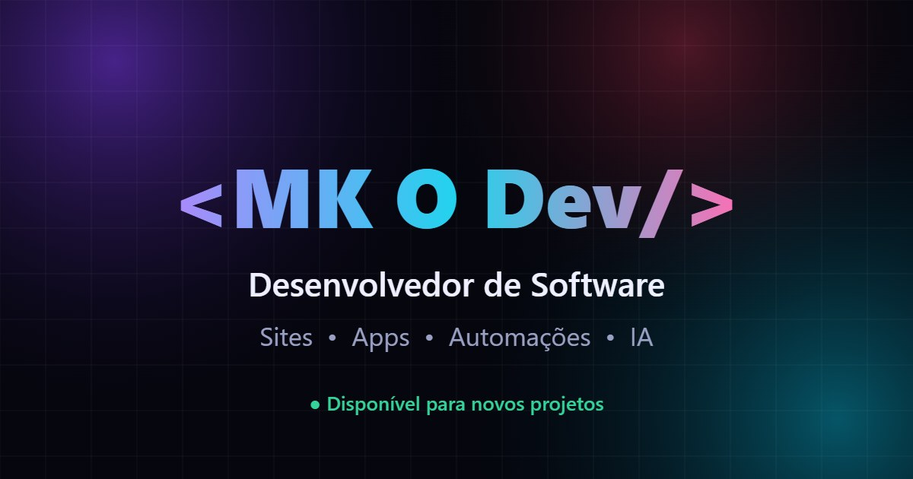

# 🌐 MK O Dev — Portfólio

Portfólio pessoal para apresentar meus serviços de desenvolvimento: sites, aplicativos, automações e soluções com IA.

## ✨ Destaques

- 🌀 **Fundo vivo** — formas de luz que se contorcem e mudam de cor conforme o scroll
- 🧭 **Navegação por abas** com rolagem suave e aba ativa automática
- 🎓 **Certificados** com visualização em tela cheia
- 📨 **Formulário de contato** integrado (recebo os dados por email) + atalho direto pro WhatsApp
- 📱 **Responsivo** — feito pensando primeiro no celular
- ⚡ **Zero dependências** — HTML, CSS e JavaScript puros, num único arquivo

## 🚀 Deploy

Publicado com **GitHub Pages** via **GitHub Actions**: todo push na `main` entra no ar automaticamente em ~1 minuto.
